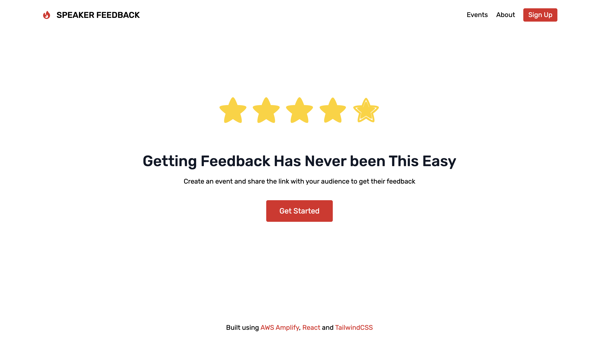

# Speaker Feedback

Speaker Feedback is a fullstack web app where speakers can receive anonymous feedback from their attendees. It's built for AWS Amplify's Hackathon.
Try the app at https://speakerfeedback.xyz

## Tech Stack

It's built using the following tools:
- [React.js](https://reactjs.org) as the front-end framework
- [TailwindCSS](https://tailwindcss.com) for styling
- [AWS Amplify](https://docs.amplify.aws/) for setting up backend resources:
  - GraphQL API with Authorization (API)
  - Authentication (Auth)
  - Automatic Deployments (Hosting)

## Possible Improvements

This project is an MVP and to improve it, here are a couple of idea:
- Upload an image for the event (using amplify  [Storage](https://docs.amplify.aws/lib/storage/getting-started/q/platform/js`)
- Generate OG image for each event based on the event's title and description
- Allow user to edit event details
- Add pagination and filtering when viewing feedback for the event.
- Add a pole model and get anonymous live votes using Subscriptions (possibly add a countdown timer for the poll like Twitter)
- Add a limit on the number of events that a user can create, if they want to create more they need to pay

## Important notes while building this app

If you've never used AWS Amplify there are a lot of [tutorials](https://docs.amplify.aws/start) for different frameworks.
### Needed to update the GraphQL Queries and Mutations to fit my needs

AWS Amplify auto-generates GraphQL queries, mutations and subscriptions based on the data model. It's very convenient but for my use case I needed to modify the queries and mutations otherwise there would be authorization errors.

### Deployment 

Deployment and adding a custom domain were smooth. However, I got an "access denied" error when trying to access an event at `https://speakerfeedback/event/:id` without being logged in. Similar to this [issue](https://github.com/aws-amplify/amplify-console/issues/436). The solution was to setup a redirect by going to App settings > Rewrites and redirects.

| source address                                                     | target address | Type          | Country Code |     |
| ------------------------------------------------------------------ | -------------- | ------------- | ------------ | --- |
| </^((?!.(css\|gif\|ico\|jpg\|js\|png\|txt\|svg\|woff\|ttf)$).)*$/> | /index.html    | 200 (rewrite) |

